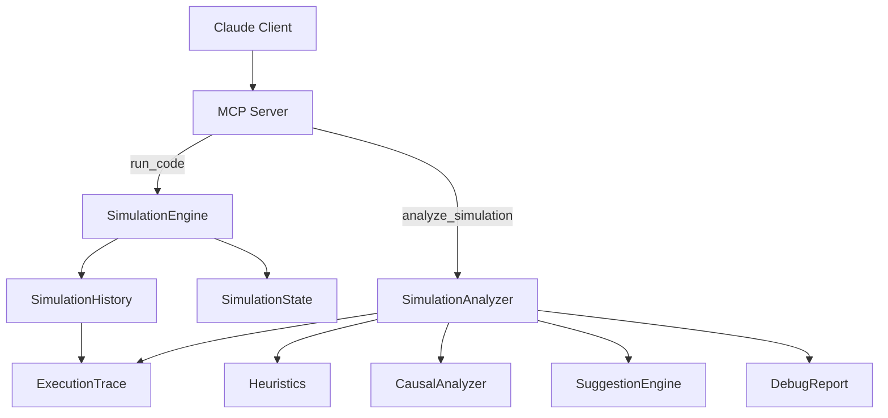
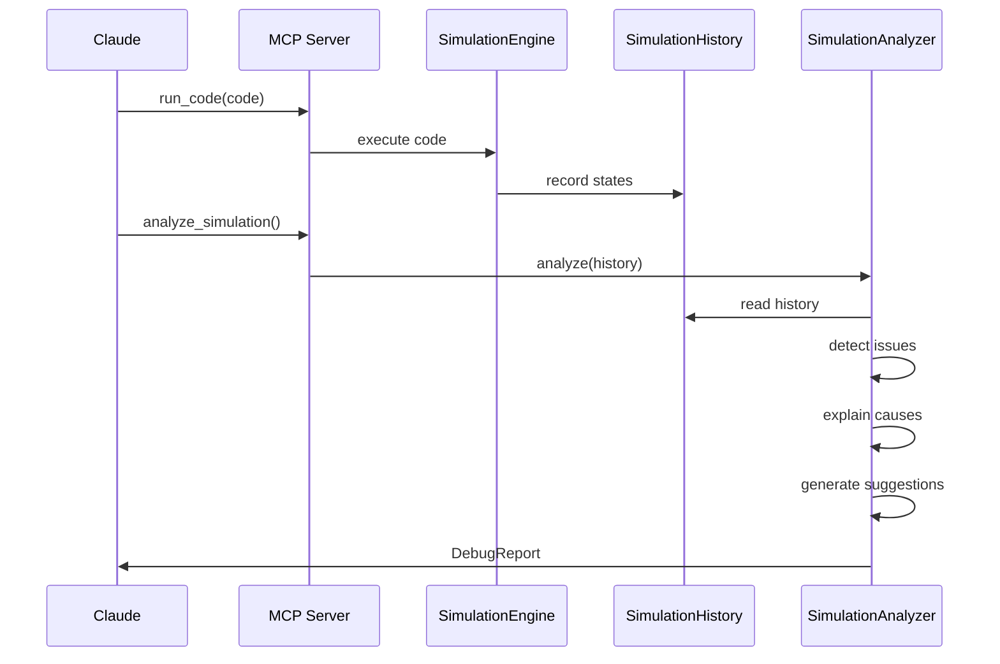

# MCP Simulation Code Debugger — Day 10

An AI-powered simulation-based code debugger built using the **Model Context Protocol (MCP)**.  
This system executes Python code step-by-step, tracks execution state, detects runtime issues, explains root causes, and **generates automated fix suggestions**, all consumable by Claude as MCP tools.

Day 10 marks the transition from simple error detection to **actionable debugging intelligence**.

---

## 🚀 Day 10 Highlights

By the end of Day 10, the system can:

- Execute Python code via MCP
- Track execution state across steps
- Detect runtime issues using heuristics
- Perform causal analysis to explain failures
- Generate automated fix suggestions
- Return a structured `DebugReport`

This is no longer a toy debugger — it is a foundation for AI developer tooling.

---

## 🚀 Day 10 Highlights


---

## 🔄 Execution & Analysis Flow


---

## 📁 Project Structure

```pgsql
src/
├── server.py
│
├── common/
│   └── types.py
│
├── simulation/
│   ├── engine.py
│   ├── state.py
│   └── history.py
│
└── debugger/
    ├── analyzer.py
    ├── heuristics.py
    ├── causal.py
    ├── suggestions.py
    ├── trace.py
    └── report.py
```
---

## 🧩 Core Components

#### SimulationEngine
- Executes Python code line-by-line
- Updates variables and execution state
- Records each step in history

#### SimulationState
- Tracks Step number, Variables, Last operation, Call stack, SimulationHistory
- Stores ordered execution states
- Serves as the source of truth for analysis

#### ExecutionTrace
- Converts history into a structured trace
- Used for analysis and heuristics

## 🧠 Debugging Intelligence

#### Heuristics
- Detect known bug patterns:
- Division by zero
- Invalid operations
- Unsafe states

#### Causal Analyzer

Explains why an issue occurred:
- Tracks variable assignments
- Identifies upstream causes

## Suggestion Engine

- Maps issues to recommended fixes.
- Example:

Issue: division_by_zero

Suggestion: Add guard or exception handling

## 📦 Data Models (common/types.py)

- Issue
- Suggestion
- DebugReport

All MCP responses are structured and machine-readable.